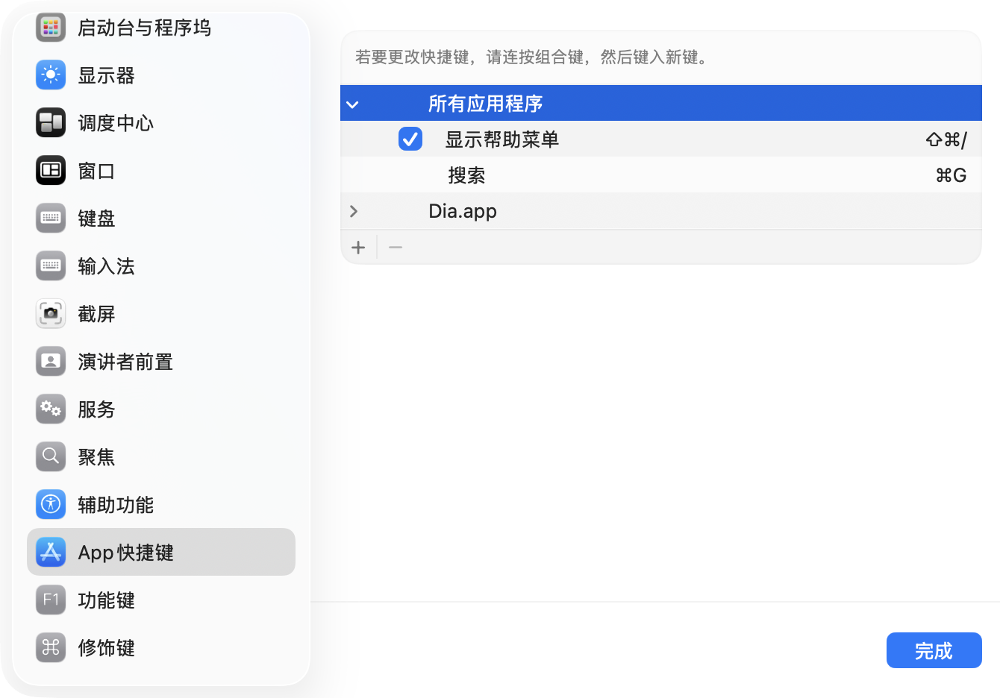

使用环境：Mac+Dia

Arc 作为主力浏览器时，一直使用 Chrome 扩展 Hotkeys for Search 实现选中文本配合自定义快捷键（⌘+G）快速搜索，该扩展停止更新后，一直没有找到好的替代方案；

用上 Dia 后习惯不懂就问 AI，发现可以通过 Mac 自带的 Automate/自动操作 添加“搜索动作”脚本，然后结合设置 - 键盘 - 键盘快捷键，为浏览器（Dia）添加自定义快捷键，实现该功能，拜托了对浏览器扩展的依赖，特别方便；

具体方法如下：

### 在 Mac 的“自动操作”（Automator）中创建一个用于**搜索选中文本**的快速操作，步骤如下

1. **打开自动操作应用程序**  
    你可以通过 Spotlight 搜索“Automator”或在“应用程序”文件夹中找到并打开它
    
2. **新建快速操作**  
    在 Automator 中，选择“文件”>“新建”，然后选择“快速操作”作为文稿类型，点击“选取”
    
3. **设置工作流程接收内容**  
    在顶部设置“工作流程收到当前”选择“文本”，这样工作流程会接收你在任何应用中选中的文本作为输入
    
4. **添加搜索操作**
    
    - 在左侧“资源库”搜索栏输入“运行 AppleScript”操作，将其拖入右侧工作流程区域
        
    - 你可以写一个简单的脚本，将选中的文本作为参数传递给系统默认浏览器，进行网络搜索。

	```
	on run {input, parameters}
	set query to (do shell script "python3 -c 'import sys, urllib.parse; print(urllib.parse.quote(sys.argv[1]))' " & quoted form of input as string)
	set searchURL to "https://www.google.com/search?q=" & query
	do shell script "open " & quoted form of searchURL
	return input
	end run
	```

    这个脚本会将选中的文本编码后用默认浏览器打开 Google 搜索页面。
    
5. **保存快速操作**  
    选择“文件”>“存储”，给快速操作命名，比如“搜索”（该名称很重要，它将出现在各应用菜单栏的 services/服务 选项中，方便后面添加快捷键时指定菜单标题）

### 打开 Mac 的设置 - 键盘 - 键盘快捷键

1. 在 App 快捷键选项中点击 + 添加自定义  
   
2. 这里可选择在特定应用程序（如浏览器）中使用该功能，也可在所有应用程序中使用该功能（若快捷键冲突，设置不常用的组合即可）  
   

作为程序小白，以上流程大多在 AI 指导下完成，操作过程有误，请咨询 AI。
